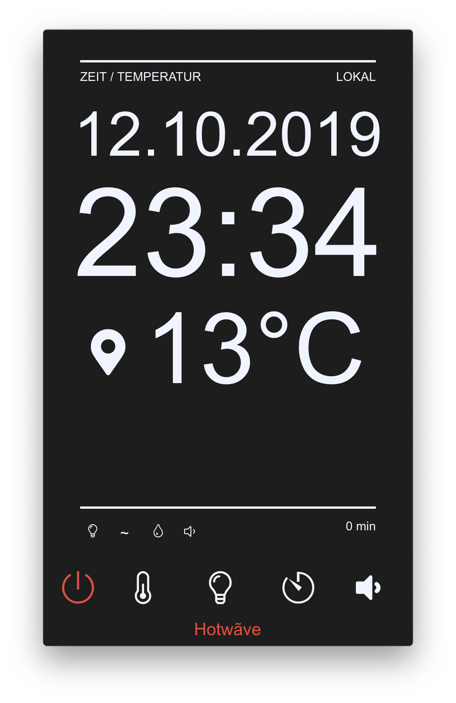
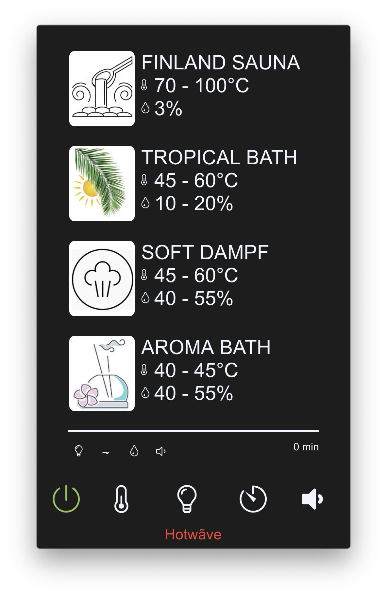
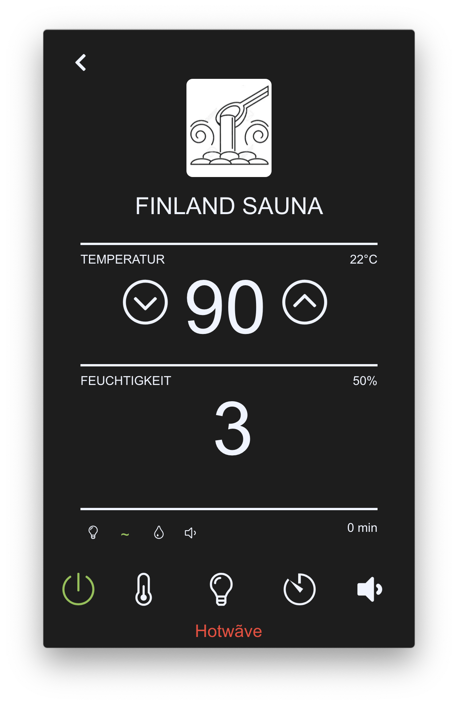
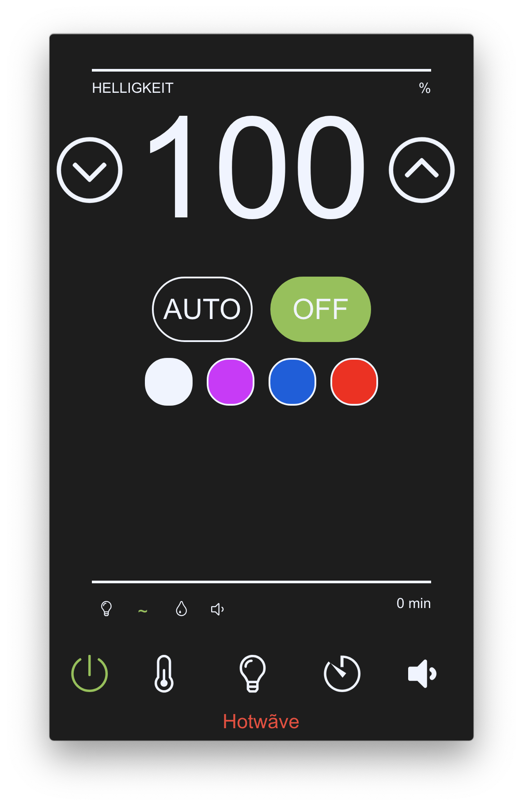
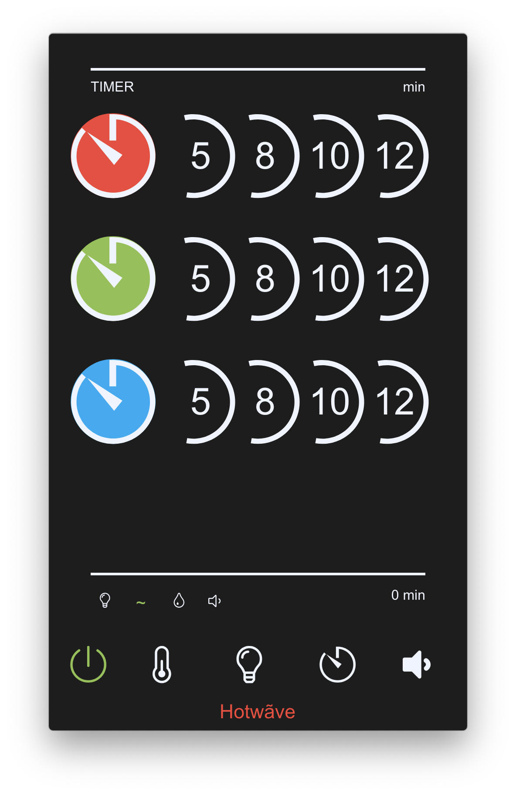
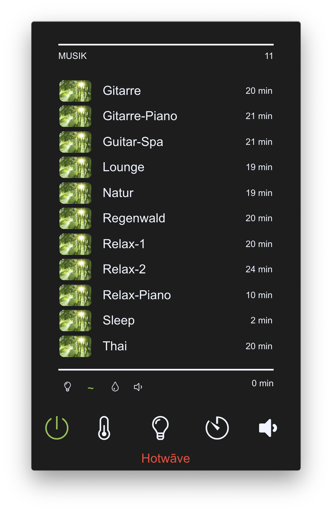

## Heatwave
[](https://actions-badge.atrox.dev/kegesch/sauna-control/goto?ref=master)

<div style="width: 128px; margin: 20px auto"> </div>

***

An electron-based sauna control. Written in React.

### Screenshots







### Table of contents

- [Install](#install)
- [Usage](#usage)
- [Code of Conduct](#code-of-conduct)

### Install

#### Install dependencies

```
npm install
```

or

```
yarn install
```

### Usage

#### Run the app

```
npm run start
```

or

```
yarn start
```

#### Build the app (automatic)

```
npm run package
```

or

```
yarn package
```

#### Build the app (manual)

```
npm run build
```

or

```
yarn build
```

#### Test the app (after `npm run build` || `yarn run build`)

```
npm run prod
```

```
yarn prod
```

### Code of Conduct

[Contributor Code of Conduct](code-of-conduct.md). By participating in this project you agree to abide by its terms.
